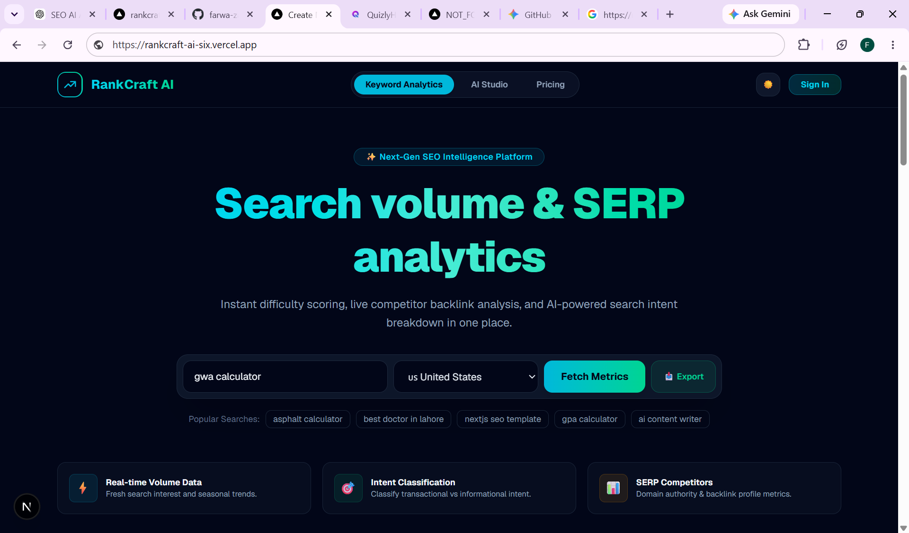
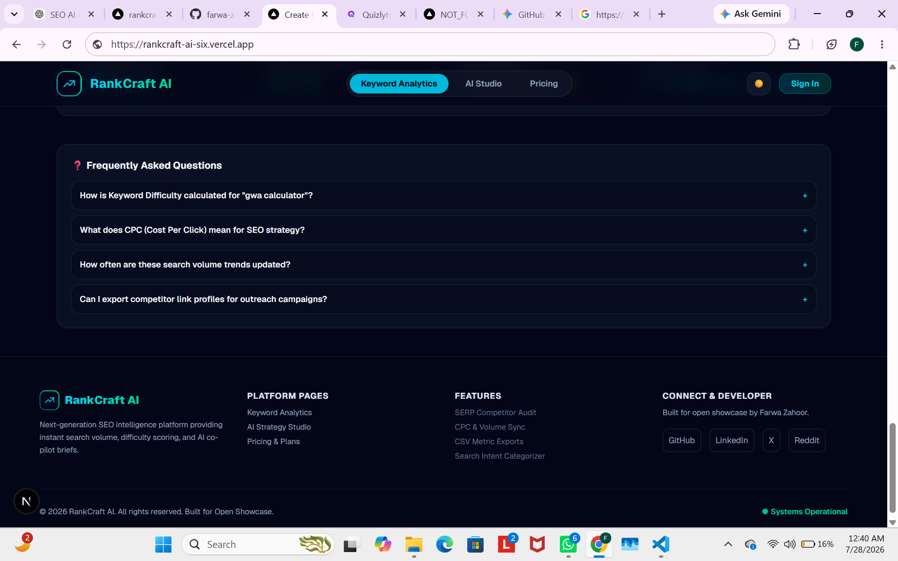

# RankCraft AI 🚀

## Overview

RankCraft AI is an AI-powered SEO assistant that helps content creators, bloggers, students, and businesses improve their search engine visibility.

The app helps users analyze keywords, discover trends, get SEO insights, generate SEO-optimized articles, create meta titles and descriptions, and improve their content strategy using AI.

## Problem It Solves

Many people struggle with SEO research, keyword selection, understanding trends, and creating optimized content.

RankCraft AI solves this problem by providing keyword analysis, trend insights, SEO recommendations, and AI-powered content generation in one platform.

## Live Demo

🔗 Live URL: https://rankcraft-ai-six.vercel.app

## Features

- 🔍 Keyword Analysis
- 📈 SEO Trend Analysis
- 🤖 AI-powered Article Generator
- 📝 Meta Title Generation
- 📝 Meta Description Generation
- ❓ FAQ Generation
- 🔗 Internal Linking Suggestions
- 📊 SEO Recommendations
- 🎨 Responsive Modern UI

## AI Feature

RankCraft AI uses OpenRouter API with an AI language model to generate SEO-friendly content.

The AI feature generates:
- SEO optimized articles
- Search intent based content
- Proper headings structure
- FAQs
- Internal linking ideas
- Schema recommendations

### AI System Prompt

## Tools & Technologies Used

- Next.js
- TypeScript
- Tailwind CSS
- OpenRouter API
- AI Language Model
- Vercel

## Screenshots

### Homepage



### AI Studio


### Keyword Analysis




## How To Run Locally

Install dependencies:

```bash
npm install
